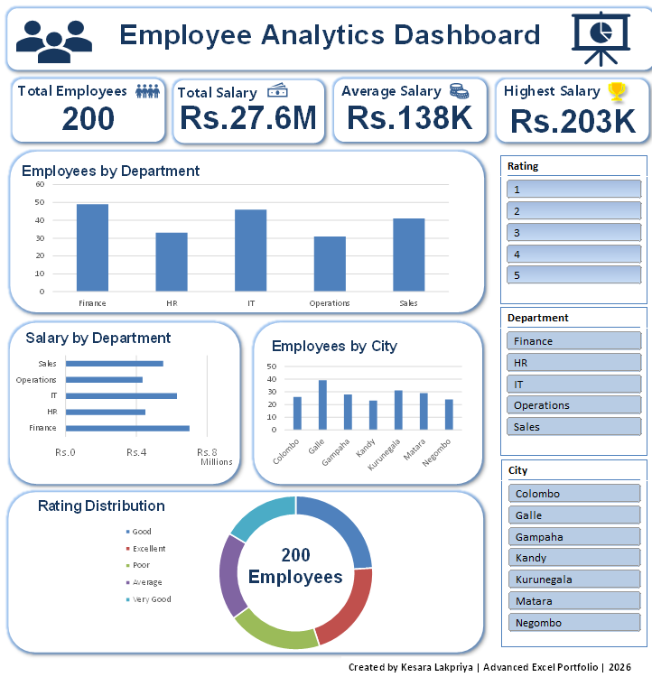

# 👥 Employee Analytics Dashboard

A professional Employee Analytics Dashboard developed in Microsoft Excel to transform raw HR data into meaningful business insights through interactive visualizations, KPI tracking, and dynamic filtering.

---

## 📷 Dashboard Preview

<p align="center">

</p>

---

# 📌 Project Overview

Organizations generate large volumes of employee data, making it difficult to quickly identify workforce trends and performance metrics.

This dashboard provides an interactive HR analytics solution that enables users to monitor employee statistics, salary information, department performance, and geographical distribution using Microsoft Excel.

The dashboard is fully interactive through slicers, allowing decision-makers to analyze data dynamically without writing formulas.

---

# 🎯 Business Objectives

- Monitor total workforce statistics
- Analyze salary distribution
- Compare department performance
- Evaluate employee ratings
- Analyze employee locations
- Build an interactive HR reporting dashboard

---

# 📊 Dashboard Features

### KPI Cards

- 👥 Total Employees
- 💰 Total Salary
- 📈 Average Salary
- 🏆 Highest Salary

---

### Interactive Visualizations

- Employees by Department
- Salary by Department
- Employees by City
- Rating Distribution

---

### Interactive Filters

- Rating
- Department
- City

---

# 🛠 Skills Demonstrated

- Advanced Microsoft Excel
- Dashboard Development
- Business Intelligence Reporting
- Data Visualization
- Pivot Tables
- Pivot Charts
- KPI Design
- Interactive Slicers
- XLOOKUP
- INDEX + MATCH
- Dynamic Reporting
- HR Analytics

---

# 📂 Dataset Information

The dashboard was developed using a simulated employee dataset containing:

- Employee Details
- Departments
- Cities
- Salaries
- Performance Ratings

---

# 📈 Key Insights

- Track employee distribution across departments.
- Compare salary allocation between departments.
- Analyze employee ratings.
- Monitor workforce distribution by city.
- Filter reports dynamically using slicers.

---

# 💼 Business Value

This dashboard helps HR teams and business managers:

- Monitor workforce KPIs
- Analyze salary trends
- Identify department performance
- Improve reporting efficiency
- Support data-driven decision making

---

# 📷 Technologies Used

| Tool | Purpose |
|------|---------|
| Microsoft Excel | Dashboard Development |
| Pivot Tables | Data Aggregation |
| Pivot Charts | Data Visualization |
| Slicers | Interactive Filtering |
| XLOOKUP | Data Retrieval |
| INDEX + MATCH | Advanced Lookup |
| Conditional Formatting | KPI Highlighting |

---

# 📁 Repository Structure

```
employee-analytics-dashboard-excel
│
├── Employee Analytics Dashboard.xlsx
├── dashboard.png
├── README.md
├── screenshots
│   └── dashboard.png
└── LICENSE
```

---

# 🚀 Future Improvements

- Employee Search Panel
- Power Query Integration
- Power Pivot Data Model
- DAX Measures
- Power BI Version

---

# 👨‍💻 Author
## Kesara Lakpriya
📧 Email:
kesaralakpriya@gmail.com
💻 GitHub:
https://github.com/42Kesara

---

## ⭐ If you found this project useful, consider giving it a Star.
